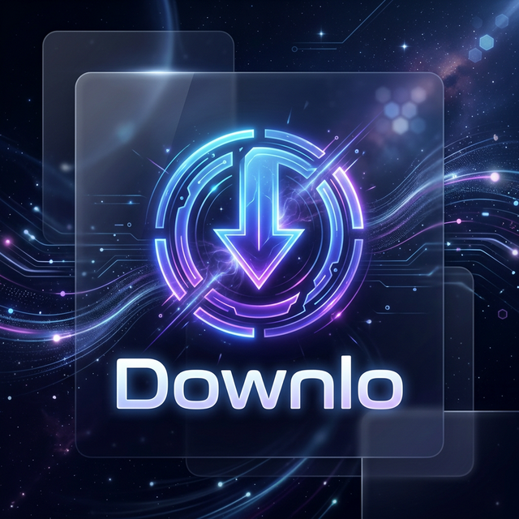

<div align="center">



# 🚀 Downlo (Media Vault)

**The ultimate self-hosted media sanctuary. Download, manage, and enjoy your favorite content from YouTube and Spotify with ease.**

[](https://www.docker.com/)
[](https://fastapi.tiangolo.com/)
[](https://www.python.org/)
[](https://tailwindcss.com/)

[Features](#-key-features) • [Tech Stack](#-tech-stack) • [Quick Start](#-quick-start) • [Configuration](#-configuration) • [Screenshots](#-screenshots)

</div>

---

## ✨ Key Features

- 📥 **Universal Downloader**: Seamlessly grab videos and audio from YouTube and tracks from Spotify.
- ⚡ **High Fidelity**: Automatically fetches the highest quality available (up to 320kbps for audio, 4K for video).
- 🎨 **Modern Interface**: A stunning, dark glassmorphic UI built with Tailwind CSS for a premium feel.
- 🐳 **Docker Powered**: Easy deployment and isolated environment using Docker and Docker Compose.
- 📂 **File Management**: Built-in file browser to view, download to your device, or delete your media.
- 🔄 **Real-time Progress**: Live updates on download speed, ETA, and job status.
- 🔒 **Self-Hosted**: Your data, your server. Complete privacy and control over your media library.

---

## 🛠 Tech Stack

| Component | Technology |
| :--- | :--- |
| **Backend** | Python 3.11, FastAPI, Uvicorn |
| **Download Engines** | `yt-dlp` (YouTube), `spotdl` (Spotify) |
| **Media Processing** | `ffmpeg` (Stream merging & post-processing) |
| **Frontend** | Vanilla JS, Tailwind CSS (Glassmorphism design) |
| **Infrastructure** | Docker, Docker Compose |

---

## 🚀 Quick Start

### 1. Prerequisites
- [Docker](https://docs.docker.com/get-docker/)
- [Docker Compose](https://docs.docker.com/compose/install/)

### 2. Deployment
Clone the repository and spin up the container:

```bash
docker compose up -d
```

Access the web interface at: `http://localhost:8000`

---

## ⚙️ Configuration

Downlo can be configured via environment variables in your `docker-compose.yml` or a `.env` file.

| Variable | Description | Default |
| :--- | :--- | :--- |
| `SPOTIFY_CLIENT_ID` | Your Spotify Developer App Client ID | (Required for Spotify) |
| `SPOTIFY_CLIENT_SECRET` | Your Spotify Developer App Client Secret | (Required for Spotify) |
| `DOWNLOAD_DIR` | Internal container path for downloads | `/app/downloads` |

> [!TIP]
> Get your Spotify credentials at the [Spotify Developer Dashboard](https://developer.spotify.com/dashboard).

---

## 📂 Project Structure

```text
/media-vault
├── docker-compose.yml   # Orchestration & Environment
├── Dockerfile           # Multi-stage Docker build
├── requirements.txt     # Python dependencies
└── /app
    ├── main.py          # FastAPI Backend Logic
    ├── /static          # Frontend Assets (HTML/JS)
    └── /downloads       # Persisted Media Storage (Volume)
```

---

## 🤝 Contributing

Contributions are welcome! Feel free to open an issue or submit a pull request if you have ideas for new features or improvements.

---

<div align="center">
Built with ❤️ for the self-hosting community.
</div>
